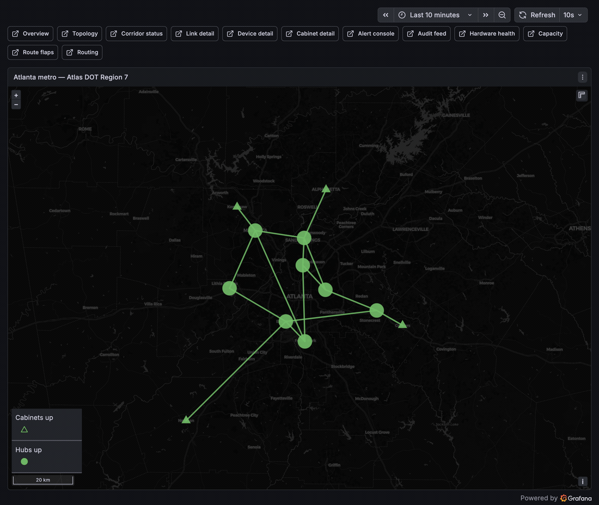

# Features — what this demo does and how to try each one

This is the guided tour. Each feature below has the same shape: **what it is**
(in plain language), **why it matters**, **how to try it**, and **what you'll
see**.

Before you start, make sure the demo is running (`make up`) and you can open
**Grafana** at <http://grafana.127-0-0-1.nip.io:8080> (`admin` / `admin`). If
not, see [GETTING-STARTED.md](GETTING-STARTED.md).

> **The 30-second mental model.** The demo simulates a city's fiber-optic
> network for transportation systems (traffic cameras, signals, etc.) across
> Atlanta. There are two kinds of routers: 8 modern ones (the "backbone") and
> 4 older ones (the "field cabinets"). When a connection fails, the system
> notices, figures out **who is affected** and **how bad it is**, writes it up,
> and — if you let it — **fixes the routing automatically**. You trigger
> failures with simple commands and watch the response unfold in Grafana.

The router names you'll use in commands:

- **Backbone (modern):** `tmc-1`, `tmc-2`, `hub-n`, `hub-e`, `hub-i20e`,
  `hub-nw`, `hub-sw`, `hub-i20w`
- **Field cabinets (legacy):** `fc-i20e`, and other `fc-*` names

---

## 1. The core: an alert that enriches itself and heals

**What it is.** The headline feature. When a network link goes down, most
systems just say "interface down." This demo takes that bare alert and
automatically adds context: which fiber cable it is, which provider owns it,
which highway corridor it runs along, which government agencies lose service,
and how severe it is. It produces a rich, human-readable incident message —
and when the link comes back, **the same message updates itself to "resolved"**
instead of spamming a second alert.

**Why it matters.** This is the difference between "something broke, go figure
out what" and "the ADOT-owned cable on I-20 East is down, isolating field
cabinet fc-i20e and three agencies, severity high." The on-call person
knows what's happening before they even open a laptop.

**How to try it.**

```bash
make demo-cut NODE=hub-i20e INTERFACE=ethernet-1/4
```

Wait about 30–60 seconds, then heal it:

```bash
make demo-restore NODE=hub-i20e INTERFACE=ethernet-1/4
```

**What you'll see.**
- In **Grafana** (Geomap or Overview dashboard): the affected node and link
  turn **red**, then green again after restore.
- In **Argo Workflows** (<http://workflows.127-0-0-1.nip.io:8080>): a workflow
  named `enrich-notify-…` runs the enrich → analyze → notify steps.
- The incident message itself is built even without Slack configured — it's
  printed to the workflow's logs. To send it to a real Slack channel, see
  [SECRETS.md](SECRETS.md) (optional).

> **Tip:** the cut above (`hub-i20e` / `ethernet-1/4`) is the best one for a
> demo because it isolates a field cabinet and several agencies, so the
> enrichment is dramatic. A cut on the perimeter ring instead (e.g. `hub-e` /
> `ethernet-1/1`) reroutes around the break and affects no agencies — which is
> a nice contrast to show that the system understands redundancy.

---

## 2. Two kinds of failure: modern backbone vs. legacy cabinet

**What it is.** The demo deliberately monitors its two router types in two
different eras of technology — the modern backbone streams live telemetry
(gNMI), the old cabinets are polled the old-fashioned way (SNMP) — but the
**incident response is identical for both**.

**Why it matters.** Real networks are a mix of new and old gear. This shows you
don't have to replace everything to get modern, automated incident response.

**How to try it.** The backbone commands you already saw:

```bash
make demo-cut NODE=hub-e INTERFACE=ethernet-1/1
make demo-restore NODE=hub-e INTERFACE=ethernet-1/1
```

And the legacy field-cabinet equivalents:

```bash
make demo-cut-cabinet NODE=fc-i20e INTERFACE=eth1
make demo-restore-cabinet NODE=fc-i20e INTERFACE=eth1
```

**What you'll see.** The same enrich → analyze → notify pipeline reacts to both,
even though one came from streaming telemetry and the other from SNMP polling.

---

## 3. Pre-canned scenarios (one command, a whole storyline)

**What it is.** Instead of cutting links by hand, these run realistic, named
outage stories on a timer and clean up after themselves.

**How to try it.** See the menu first:

```bash
make scenario-list
```

Then run any of them:

```bash
make scenario-hurricane    # two ring segments fail in series (~2.5 min)
make scenario-backhoe      # one random backbone strand cut (~2 min)
make scenario-cabinet      # a field-cabinet uplink fails (~1.5 min)
make scenario-flap         # a link rapidly flaps up/down (~3 min)
```

There's also a **"gray failure"** — a link that doesn't fail outright but
slowly degrades (rising errors, fading optical signal), which is exactly the
kind of subtle problem that's hard to catch:

```bash
make scenario-gray-failure LINK=ring-e-i20e
make scenario-gray-failure-end LINK=ring-e-i20e   # clear it early if you want
```

**What you'll see.** Each scenario drives the same detection-and-response flow,
but with different shapes — watch Grafana and Argo Workflows during each.



> `make scenario-hurricane` on the geomap: `hub-i20e` and two ring segments go
> red as the storm takes the corridor (stranding the `fc-i20e` cabinet), then
> the network heals back to all-green as the strands are restored in series —
> the whole arc unattended, recorded headless ([`bin/make-gif.sh`](bin/make-gif.sh)).

---

## 4. Closed-loop remediation (the system fixes the routing itself)

**What it is.** When a link degrades, the system can automatically tell the
routers on both ends to **stop using that link** (it raises the routing
"cost"), so traffic reroutes around the problem. When the link recovers, it
**undoes** the change. "Closed-loop" means detect → act → verify with no human
in the middle.

**Why it matters.** This is the leap from *alerting* (telling a human to do
something) to *automation* (the system doing the safe, reversible thing
immediately, day or night).

**How to try it.** There are two modes. Check the current one:

```bash
make remediation-status
```

- **`auto`** (default): the system acts on its own.
- **`gated`**: the system *prepares* the fix but waits for your approval first —
  good for showing a human-in-the-loop safety valve.

Switch modes:

```bash
make remediation-mode MODE=gated
```

Now trigger a degradation (the gray-failure scenario is ideal), and when a fix
is pending, approve it:

```bash
make remediation-approve LINK=ring-e-i20e
```

**What you'll see.** In `gated` mode the workflow pauses waiting for your
approval; after you approve (or immediately, in `auto` mode) the routing metric
on both ends of the link changes, and `make remediation-status` lists the
active cost-outs. Restoring the link removes them.

> **Safety note:** the automation is deliberately limited to a safe, reversible
> routing change. The AI feature (below) is **advisory only** and never touches
> the network.

---

## 5. Config drift audit (catching out-of-band changes)

**What it is.** Every 5 minutes the system compares each router's **live
configuration** against the **intended configuration** (the project's source of
truth). If someone changed a device by hand — "out-of-band," outside the proper
process — it raises a `ConfigDrift` alert.

**Why it matters.** Unmanaged manual changes are a top cause of outages. This
catches them automatically and routes them through the same incident pipeline.

**How to try it.** A `demo-cut` *is* an out-of-band change (it disables an
interface directly), so it will register as drift. Trigger the check on demand
instead of waiting 5 minutes:

```bash
make demo-cut NODE=hub-i20e INTERFACE=ethernet-1/4
make drift-check
```

**What you'll see.** A `ConfigDrift` alert fires and flows through the same
notify pipeline as any other incident. Restore the link and the next audit
shows it clean again.

---

## 6. Postmortem generator (the automatic write-up)

**What it is.** When an incident resolves, the system writes a **postmortem** —
a Markdown report with the timeline, what was affected, whether it met the
service-level agreement (SLA), the telemetry around the event, and (if the AI
feature ran) the AI's narrative.

**Why it matters.** Writing incident reports by hand is tedious and often
skipped. Here it's free and consistent, every time.

**How to try it.** Run a full incident (cut → wait → restore), then:

```bash
make postmortem                       # lists stored postmortems
make postmortem FP=<fingerprint>      # prints and saves one
```

(The "fingerprint" is the incident's ID; `make postmortem` with no argument
lists the available ones to copy from.)

**What you'll see.** A clean report printed to your terminal and saved to a
file, covering timeline, impact, SLA verdict, and telemetry.

---

## 7. AI incident analyst (optional — an AI second opinion)

**What it is.** An **optional** AI agent that investigates an incident the way a
human engineer would: it queries the live network (read-only), the monitoring
data, and the source-of-truth database, then writes a structured analysis —
summary, probable root cause, recommendation, confidence, and the evidence it
used.

**Why it matters.** It turns raw telemetry into a plausible explanation and a
suggested next step, in seconds. It is **advisory forever** — by design it can
only *look*, never *change* anything. The automatic fixing stays with the
deterministic remediation (feature 4).

**How to try it.** This feature is **off until you give it an AI endpoint** —
with no configuration it simply does nothing and the rest of the demo is
unaffected. You can point it at a paid service (OpenAI, Anthropic/Claude,
Google Gemini) **or** run a model locally for free with [Ollama](https://ollama.com).
The exact `kubectl create secret …` recipes for each option are in
[SECRETS.md](SECRETS.md) (look for the "AI incident analyst" section).

Once configured, just cause an incident as usual:

```bash
make demo-cut NODE=hub-i20e INTERFACE=ethernet-1/4
```

**What you'll see.** Alongside the normal pipeline, an `ai-analyze-…` workflow
runs and publishes its analysis — visible on the **Alert console** dashboard in
Grafana, folded into the postmortem, and (if you set up the per-incident
dashboard below) rendered right on the incident's own dashboard.

---

## 8. Per-incident Grafana dashboard (a dashboard built for each outage)

**What it is.** The moment an alert fires, the system **automatically builds a
Grafana dashboard dedicated to that one incident** — link state, traffic, the
health of every downstream device ("did the backup path hold?"), the AI
analysis, and the relevant logs — all in one place. When the incident resolves,
the dashboard is **automatically deleted**.

**Why it matters.** Instead of hunting across general dashboards during an
outage, the responder lands on a page assembled specifically for *this* event,
with exactly the panels that matter.

**How to try it.** Just cause an incident:

```bash
make demo-cut NODE=hub-i20e INTERFACE=ethernet-1/4
```

Then in Grafana, open the dashboard list and look in the **"Incidents"**
folder — a new dashboard named `INCIDENT — … on hub-i20e (…)` appears within
about 30 seconds. Restore the link and it disappears.

**What you'll see.** A purpose-built dashboard: a header with severity and the
affected cable/agencies, colored UP/DOWN timelines for the link, status chips
for downstream devices, and an AI-analysis panel that fills in once the AI
finishes (if feature 7 is enabled).

---

## 9. Maintenance windows (planned work without false alarms)

**What it is.** Before doing planned work on a node, you open a **maintenance
window** for it. Alerts for that node are silenced for the duration, so planned
work doesn't trigger a false incident.

**How to try it.**

```bash
make maintenance-start NODE=hub-e HOURS=2   # silence hub-e for 2 hours
make maintenance-list                        # see active windows
make maintenance-end NODE=hub-e              # close it early
```

**What you'll see.** While the window is open, cutting that node's links won't
raise the usual incident; closing the window restores normal alerting.

---

## 10. Scenario console (drive the demo from a browser)

**What it is.** A NOC-style web console at <http://console.127-0-0-1.nip.io:8080>:
a reactive status bar (nodes up · links down · alerts firing · workflows,
polled live and turning red when something's wrong), control cards to
cut/restore a link, start/stop a gray failure, and open/close a maintenance
window, **one-click canned scenarios** (hurricane / backhoe / cabinet / flap),
a streaming event log, and toasts. It ships in two looks — **Mission** (NOC
dashboard) and **Terminal** (CLI/phosphor) × **Dark/Light** — toggled in the
top bar and remembered.

**Why it matters.** You can run the whole demo from one browser tab while
Grafana narrates on another — no terminal needed. The console has **no power
to touch devices**: every button just asks the existing pipeline to act
(it POSTs events; the workflows do the work), so it's safe to hand to anyone.
Everything it shows is real — the status tiles come straight from Prometheus/
Argo and the log records the actual commands and their outcomes (no faked
telemetry).

**How to try it.** Open the URL, pick a node + interface, click **Cut** —
watch the tiles flash red and Grafana light up — then **Restore**. Try a
**Gray failure** on a link, a **Maintenance window** on a node, or click a
**canned scenario** to run a real multi-step storyline (it fires the real
cut/gray/restore sequence, with an abort button while it runs).

**What you'll see.** The same workflows the `make` commands trigger, fired
from the browser; the status bar and event log track the real network live.

---

## Where to go next

- Running into trouble? [`docs/runbook-troubleshoot.md`](docs/runbook-troubleshoot.md)
- Want the polished live-demo script (≈10 minutes, for an audience)?
  [`docs/runbook-demo.md`](docs/runbook-demo.md)
- Curious how it all fits together under the hood?
  [`docs/architecture.md`](docs/architecture.md)
