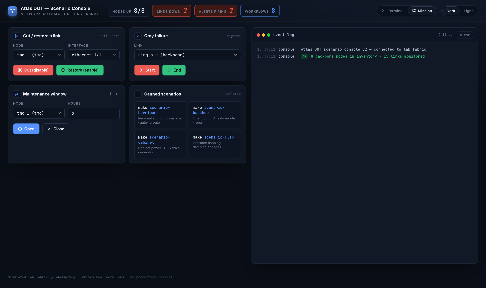
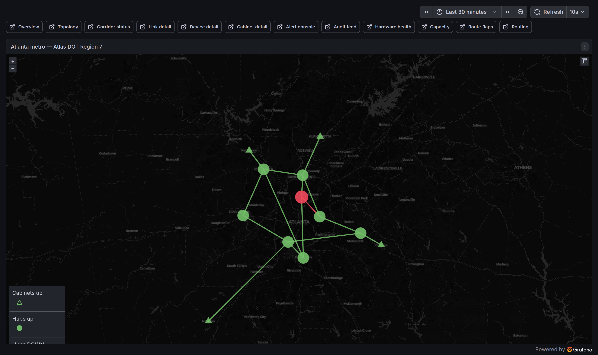
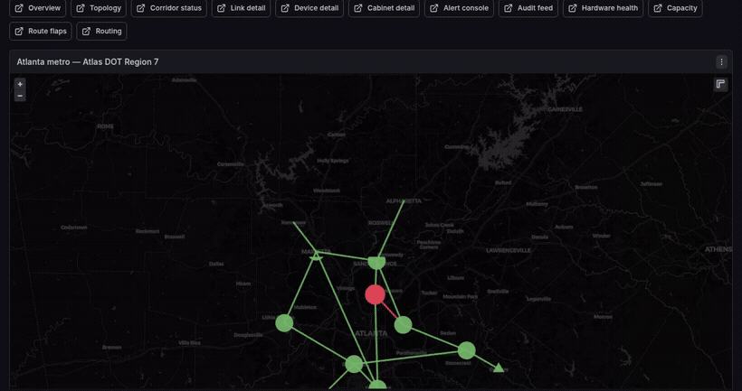
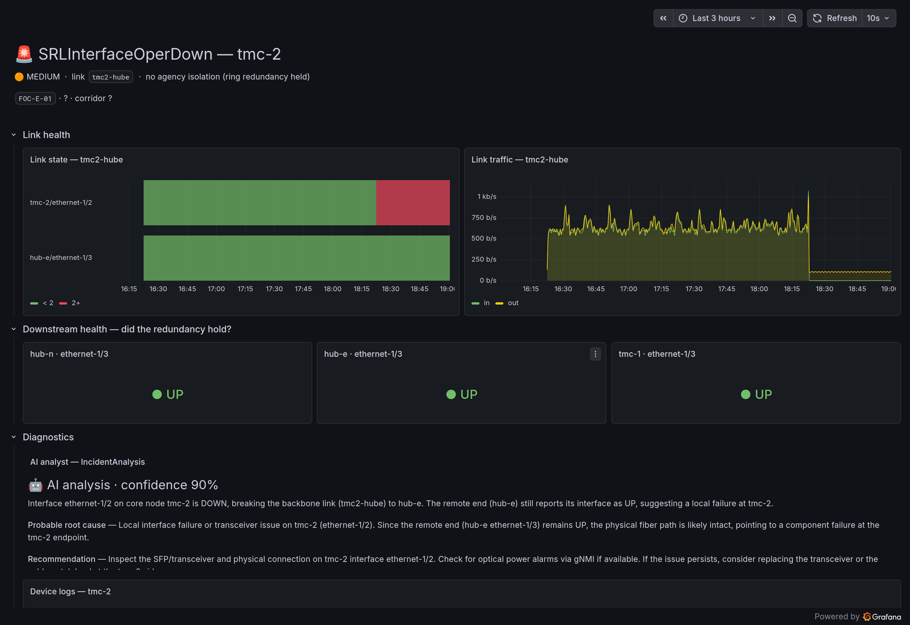
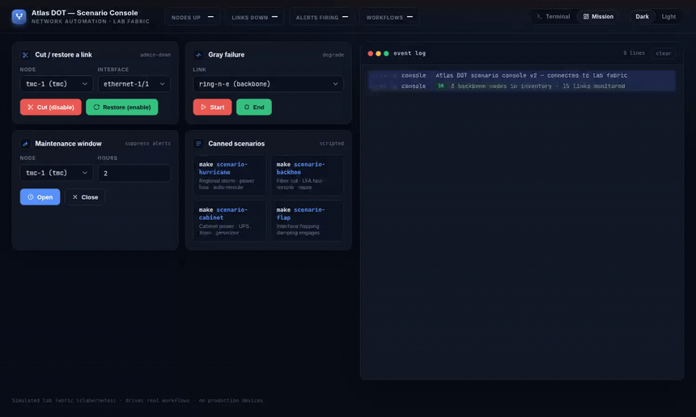

# network-automation-demo

A self-contained, GitOps-managed Kubernetes demo of streaming-telemetry-driven
incident response over a metro fiber-ring topology — SR-MPLS by design,
IS-IS/IPv4 in the lab (see [docs/architecture.md](docs/architecture.md) for the
scope cut). Runs on a single laptop. Every
artifact — SR Linux configs, FRR configs, gNMIc targets, NetBox seed,
Grafana GeoJSON, Clabernetes Topology CR, Prometheus recording rules — is
generated from one source-of-truth file: [`spec/atlanta.yaml`](./spec/atlanta.yaml).

The headline isn't "we wired up Slack." It's: a generic interface-down
alert gets enriched with NetBox context (cable, corridor, providers,
agencies), analyzed for downstream impact, and turned into an actionable
Slack message that **updates in place when the alert resolves** — driven by
a 3-step Argo Workflow with an alert-fingerprint-keyed ledger in Valkey.



> The **scenario console** — a privilege-free Go service that drives real
> fault-injection workflows (cut a link, degrade a link, open a maintenance
> window, or run a scripted scenario) and reflects live fabric state. Every
> button fires a real Argo Workflow; nothing is simulated.

## Topology

12 nodes, fictional Atlas DOT Region 7 Atlanta Metro:

- 2 Transportation Management Centers (TMC) — SR Linux backbone heads
- 6 corridor hub aggregators — SR Linux on the I-285 / I-75 / I-20 / GA-400 corridors
- 4 field-cabinet routers — FRR (Linux) eBGP into the SR-MPLS core

15 links total: an I-285 perimeter ring, TMC redundant uplinks, and per-cabinet drops.



> The fabric on a real map (Grafana Geomap) — backbone ring, hub aggregators,
> and field cabinets across the Atlanta metro. Nodes turn red the moment an
> interface goes oper-down.

## Stack

| Layer | Component |
|---|---|
| Cluster | k3d (k3s in Docker), Traefik ingress, local-path storage |
| GitOps | ArgoCD ApplicationSet over `argocd/manifests/` |
| Topology | Clabernetes operator + containerlab-flavored `Topology` CR |
| Source of truth | NetBox (CNPG Postgres + valkey-io Valkey, no Bitnami workloads) |
| Telemetry — modern | gNMIc streaming subscriptions on the SR Linux backbone → Prometheus |
| Telemetry — legacy | Prometheus `snmp_exporter` polling FRR cabinets (IF-MIB) |
| Logs | Alloy DaemonSet → Loki SingleBinary |
| Eventing | Argo Events (NATS JetStream EventBus) → Argo Workflows |
| Notifications | Slack (`slack-sdk` bot, `chat.update` on resolve) |
| Certs | cert-manager (selfsigned ClusterIssuer, traefik ingresses on `*.127-0-0-1.nip.io`) |

Working set ≈ 25 GB on a 32 GB+ laptop. ARM64 hosts work — SR Linux
(`ghcr.io/nokia/srlinux`) is multi-arch.

## Telemetry sources — the legacy / modern split

The 8 SR Linux backbone nodes stream telemetry via gNMI to gNMIc,
which exposes it as Prometheus metrics (`srl_*`, refreshed every 5–60 s
across five tiered subscription groups: `if-state`, `if-counters`,
`transceiver`, `routing`, `system`). This is the modern lane —
push-based, schema-defined, sub-second detection latency.

The 4 FRR field cabinets are deliberately *not* on that pipeline. Each
cabinet runs a tiny `snmpd` (installed on first boot via
`apk add net-snmp` in the entrypoint wrapper) listening for SNMPv2c on
UDP/161. A `prom/snmp_exporter` deployment polls each cabinet every
30 s for the standard `IF-MIB` tables, and a Prometheus-Operator
`Probe` CR registers them with kube-prometheus-stack.

The point: the rest of the demo — Alertmanager → EventSource → Sensor
→ enriched-notify Workflow → Slack — is **identical** for both
telemetry sources. The legacy edge and the modern core land at the same
incident response flow, with the same NetBox enrichment and impact
analysis. Mixed legacy/modern fleets don't have to rip-and-replace to
get modern incident response — that decoupling is the operational
takeaway.

| Lane | Nodes | Collection | Sample rate | Metric prefix |
|---|---|---|---|---|
| Modern | 8 SR Linux backbone | gNMI streaming → gNMIc | 5 s state / 10 s counters / 30 s DOM / 60 s system | `srl_*` |
| Legacy | 4 FRR field cabinets | SNMPv2c polling → snmp_exporter | 30 s | `ifOperStatus`, `ifInOctets`, … |

## Prerequisites

> **New to Docker / Kubernetes / the command line?** Start with
> **[GETTING-STARTED.md](GETTING-STARTED.md)** — a step-by-step, per-OS
> (macOS / Windows / Linux) install-and-run walkthrough written for newcomers.
> The rest of this README assumes you're already comfortable with these tools.

- Docker (or [OrbStack](https://orbstack.dev) on macOS). **Windows:** run
  everything inside [WSL 2](https://learn.microsoft.com/windows/wsl/) with the
  Docker Desktop WSL backend — see [GETTING-STARTED.md](GETTING-STARTED.md).
- [`k3d`](https://k3d.io) ≥ v5.6
- `kubectl`
- `helm`
- `make`
- `go` 1.22+ (only if you re-render from spec)
- **`fs.inotify.max_user_instances` ≥ 512** (Linux hosts). The default of 128
  is too low for this stack: the argo-events data plane crashloops with
  "too many open files" and the cut→notify automation silently never fires.
  `make up` warns if it's too low. Raise it once:
  ```bash
  sudo sysctl fs.inotify.max_user_instances=1024
  echo 'fs.inotify.max_user_instances=1024' | sudo tee /etc/sysctl.d/99-inotify.conf
  ```

## Quickstart

> **Push first.** Every ArgoCD `Application` references
> `https://github.com/jp2195/network-automation-demo.git` on branch `main`.
> Push this repo to that remote — or rewrite `repoURL` across `argocd/` and
> `bootstrap/root-app.yaml` to wherever you've put it — before `make up`.

```bash
make up        # creates k3d, installs ArgoCD, applies the root ApplicationSet
make status    # nodes + ArgoCD app state + ArgoCD URL/admin password
make down      # tear the cluster down
make render    # re-render workloads/* from spec/atlanta.yaml
```

UIs after sync settles (Traefik serves every ingress on both `:8080` plain
HTTP and `:8443` HTTPS — the `http://…:8080` URLs below avoid the self-signed
TLS warning):

| URL | Notes |
|---|---|
| <http://argocd.127-0-0-1.nip.io:8080> | admin / `make status` shows password |
| <http://netbox.127-0-0-1.nip.io:8080> | admin/admin |
| <http://grafana.127-0-0-1.nip.io:8080> | admin/admin |
| <http://workflows.127-0-0-1.nip.io:8080> | server-mode, no auth |
| <http://clabernetes.127-0-0-1.nip.io:8080> | clabernetes UI |
| <http://console.127-0-0-1.nip.io:8080> | scenario console, no auth |

### Pre-baked images

`make up` (and `make build` standalone) builds and pushes five pre-baked
images into the k3d-bundled distribution registry:

- `localhost:5001/eventing-py:latest` — Python + slack-sdk + valkey + eventing scripts.
- `localhost:5001/dom-synth:latest` — Python + valkey + dom_synth.py.
- `localhost:5001/frr-snmpd:latest` — FRR + net-snmp.
- `localhost:5001/ai-analyst:latest` — Python + Pydantic AI + the read-only
  tool deps (pygnmi Get-only, SNMP, PromQL/LogQL/NetBox over stdlib) for the
  advisory AI lane. A no-op unless you create the optional `ai-analyst`
  Secret (see `SECRETS.md`).
- `localhost:5001/console:latest` — the scenario console (Go static
  binary on distroless): drives cut/restore, gray-failure, and
  maintenance from the browser and shows a live status strip.

Note the two endpoints for the SAME registry:

- **`localhost:5001`** — used by `docker buildx … --push` from the host.
- **`atlas-demo-registry:5001`** — used by every workload manifest's
  `image:` field, because that's how the registry resolves from inside
  the cluster.

These five images deliberately stay on `:latest`: `make build` rebuilds and
pushes them on every `make up`, and the registry lives and dies with the k3d
cluster, so a pinned tag would only add a version-bump step to the edit loop
without making anything more reproducible. Upstream images (SR Linux, FRR,
gNMIc, …) ARE pinned — see `workloads/versions.yaml`.

This is configured by `k3d/config.yaml` (registry name + host port mapping).
Verify images are pushed with:

```bash
curl -s localhost:5001/v2/_catalog
```

## Demo flow



> A link cut from the console (or `make demo-cut`) propagating through the
> stack — gNMI telemetry → Prometheus alert → the node going red on the map.

Once IS-IS has converged across the 8 SR Linux backbone nodes and
snmp_exporter is reaching all 4 cabinets:

**Modern lane (gNMI / SR Linux):**

```bash
# Disable an interface via SR Linux CLI — gNMIc sees oper-status DOWN,
# Prometheus rule fires, Alertmanager webhooks the EventSource, Sensor
# triggers the enriched-notify Workflow, Slack gets a Block Kit message.
make demo-cut     NODE=tmc-1 INTERFACE=ethernet-1/1

# Re-enable it — same alert fingerprint resolves; the original Slack
# message is updated in place to RESOLVED with downtime, and a thread
# reply summarizes which downstream cabinets/agencies are restored.
make demo-restore NODE=tmc-1 INTERFACE=ethernet-1/1
```

**Legacy lane (SNMP / FRR cabinet):**

```bash
# Same enrich/analyze/notify pipeline, but the alert is sourced from
# snmp_exporter polling the cabinet's snmpd rather than streaming gNMI.
make demo-cut-cabinet     NODE=fc-n INTERFACE=eth1
make demo-restore-cabinet NODE=fc-n INTERFACE=eth1
```

The 3-step DAG:

1. **enrich** — NetBox lookup: device → site → primary IP → interface →
   cable → custom fields (corridor, provider, SLA, route description).
2. **analyze** — walk the cable graph from the affected device to find
   downstream cabinets, the agency tenants on each, and a
   `severity_class` (high if a cabinet is impacted, medium if multiple
   downstream devices, else low).
3. **notify** — branches on `alert.status`:
   - `firing`: `chat.postMessage` Block Kit; persist
     `{ts, channel, first_seen, impact}` in Valkey under
     `incident:<fingerprint>` with a 24h TTL.
   - `resolved`: load the ledger, `chat.update` the original message
     in place (✅ + downtime), thread reply with the resolution
     summary, DEL the ledger key.

### Closed-loop remediation

Gray failures are the one case IS-IS will not route around on its own — the
link stays up while the optics degrade. When `SRLOpticalDegrading` /
`SRLInterfaceErrorsHigh` fire, the `remediation` Sensor launches a
`remediate-link` Workflow that **costs the link out** (IS-IS metric 16777214
on both ends, applied over gNMI — the same management plane the telemetry
uses). Traffic shifts to the healthy ring path within seconds; when the
warning resolves, a second Workflow deletes the metric override and the link
returns to service. State (claims, mode, approvals) lives in Valkey.

```bash
make scenario-gray-failure LINK=ring-e-i20e   # watch the workflow cost the link out
make remediation-status                        # current mode + active cost-outs

make remediation-mode MODE=gated               # require human approval first
make remediation-approve LINK=ring-e-i20e      # release a pending gated remediation
make remediation-mode MODE=auto                # back to full closed-loop
```

The deterministic remediation workflow is the only component in the cluster
holding gNMI *Set* capability; everything else is structurally read-only.

### Config drift audit

NetBox + git say what the network *should* be; the drift audit proves the
network *is* that. Every 5 minutes a CronWorkflow pulls each SR Linux
node's running config over gNMI and diffs it against the rendered intent
(interface admin-state, IS-IS metric overrides). Any divergence raises a
`ConfigDrift` warning through the same enrich→notify pipeline as an
outage — so an out-of-band change (try `make demo-cut NODE=hub-e
INTERFACE=ethernet-1/3`) is caught, named precisely, and self-resolves
once the config is brought back in line. Metric overrides applied by the
closed-loop remediation are recognized as platform actions and suppressed,
not flagged.

```bash
make drift-check    # run the audit immediately
```

### Postmortem generator

Every incident closes with a written artifact. When an alert resolves, the
enriched-notify Workflow's final step assembles a Markdown postmortem —
timeline (first seen → resolved, duration), alert and cable context, impact
table (downstream devices, affected agencies), restoration-SLA math, the
link-state telemetry around the window, and device log excerpts from Loki —
and stores it in Valkey for seven days, keyed by the alert fingerprint.
When the optional AI incident analyst is enabled, its narrative for the same
fingerprint is appended as an extra section; absent, the deterministic
report stands alone.

```bash
make postmortem                      # list stored postmortems
make postmortem FP=<fingerprint>     # print one (also saved to /tmp)
```

### AI incident analyst (optional)

A parallel, **advisory-only** lane: a Pydantic-AI agent investigates the same
alert through structurally read-only tools (PromQL, LogQL, NetBox GET, gNMI
Get, SNMP GET) and emits a structured `IncidentAnalysis` (summary, probable
root cause, recommendation, confidence, evidence). It is **off** until you
create the optional `ai-analyst` Secret — point it at any OpenAI-compatible
endpoint (OpenAI, Anthropic, Gemini) or a local Ollama for zero cost; absent,
the lane no-ops and the deterministic pipeline is unaffected. The analysis
lands on the **Alert console** dashboard, is folded into the postmortem, and is
rendered onto the per-incident dashboard. It is advisory forever — it never
executes remediation. Setup recipes + tuning knobs: [`SECRETS.md`](SECRETS.md).

### Per-incident dashboard

On every firing alert, the enriched-notify pipeline auto-generates a Grafana
dashboard for that one incident (link state timeline, traffic, a downstream-
health grid, the AI analysis, device logs) as a ConfigMap in the
`incident-dashboards` namespace — discovered by the Grafana sidecar and placed
in the **Incidents** folder — and deletes it on resolve. No Grafana API token
needed; the lane holds only namespaced ConfigMap create/delete.



> An auto-generated per-incident dashboard. Link-state timeline, traffic, and a
> downstream "did redundancy hold?" grid — with the **AI analyst's** structured
> finding (root cause, recommendation, confidence) rendered in-panel. The
> analysis above was produced by a local model via Ollama at zero cost.

### Scenario console

A point-and-click way to drive the whole demo. Pick a link and cut it, degrade
a link into a gray failure, open a maintenance window, or run a scripted
scenario — every button fires a real Argo Workflow, and the status tiles and
event log reflect live fabric state (no fabricated telemetry).



See [`FEATURES.md`](FEATURES.md) for a plain-language walkthrough of each of
these with the exact command to try it.

## Slack

Without real Slack credentials the workflow's notify step prints the
Block Kit payload to stderr instead of calling the API — visible via
`kubectl logs` on the workflow step pod.

**To enable real posting without committing your bot token to git**, see
[`SECRETS.md`](./SECRETS.md) for two override patterns (hand-applied
`secrets.local/slack-bot.yaml`, or sealed-secrets for git-stored
encrypted secrets).

## Layout

```
spec/atlanta.yaml          single source of truth (12 nodes, 15 links, 11 agencies)
tools/render/              Go renderer: spec → SRL/FRR configs, gNMIc targets,
                             NetBox seed, GeoJSON, Topology CR,
                             link_membership PromRule
k3d/config.yaml            cluster shape, port maps, in-cluster registry
bootstrap/                 manual one-shot: argocd-install.sh + root-app.yaml
argocd/                    applicationset.yaml + manifests/{platform,workloads}/ per-app stubs
platform/values/           helm values for each platform chart
workloads/
  netbox/                    netbox-chart values + CNPG Cluster + seed Job
  topology/                  Clabernetes Topology CR + startup-config bundle
                               (SR Linux .cfg, FRR .frr, daemons, snmpd.conf,
                               wrapper.sh entrypoint)
  gnmic/                     gNMIc Deployment + ServiceMonitor (modern lane)
  snmp/                      snmp_exporter + Probe CR + PromRule (legacy lane)
  observability/             PromRules + AlertmanagerConfig + dashboards
  eventing/                  EventSource + Sensors + WorkflowTemplates +
                               Python step scripts (enrich/analyze/notify/remediate)
Makefile                   make up | down | status | render | demo-cut | demo-restore | remediation-*
SECRETS.md                 how to use real credentials without committing them
```

## Sync waves

| Wave | Components |
|---|---|
| `-1` | cert-manager |
| `0` | CNPG operator, Clabernetes operator, kube-prometheus-stack, Loki, argo-workflows, argo-events |
| `1` | Valkey, Alloy, Topology |
| `2` | NetBox prereqs (ClusterIssuer + CNPG Cluster), gNMIc, observability rules |
| `3` | NetBox chart, eventing CRs (EventBus + EventSource + Sensors + WFTs) |
| `4` | NetBox seed Job |

## Re-rendering from spec

Edit `spec/atlanta.yaml` and run `make render`. The renderer rewrites:

- `workloads/topology/startup-configs/*` (per-node SR Linux + FRR configs,
  shared `daemons` for FRR, shared `snmpd.conf` + `wrapper.sh` for the
  legacy-edge lane)
- `workloads/topology/topology.yaml` + `kustomization.yaml`
- `workloads/gnmic/targets.yaml`
- `workloads/netbox/seed/seed.json`
- `workloads/observability/dashboards/links.geojson`
- `workloads/observability/link-membership.yaml` (link / device / endpoint
  recording rules)
- `workloads/dom-synth/links.json` (synthetic transceiver exporter feed)

Commit the diff. ArgoCD syncs.

### Renderer drift gate

`make render-check` re-runs the renderer into `/tmp/render-check` and diffs it against the committed outputs in `workloads/`. Hand-fixes to renderer-emitted files (anything with the `Generated by tools/render — do not edit.` header) will fail this gate — the fix needs to go back to `tools/render/*` and a fresh `make render` re-run. CI will exit non-zero on drift.

## More docs

- **[`GETTING-STARTED.md`](GETTING-STARTED.md)** — newcomer-friendly,
  per-OS (macOS / Windows / Linux) install-and-run walkthrough. Start here if
  you're new to Docker/Kubernetes.
- **[`FEATURES.md`](FEATURES.md)** — plain-language tour of every feature
  (the self-enriching alert, closed-loop remediation, config-drift audit,
  postmortems, the AI analyst, the per-incident dashboard, scenarios,
  maintenance windows) with the exact command to try each one.
- [`docs/architecture.md`](docs/architecture.md) — layered architecture,
  why each piece is here, the gNMI / SNMP / DOM split, eventing flow.
- [`docs/runbook-demo.md`](docs/runbook-demo.md) — pre-demo checklist,
  the live demo script (≈10 min), optional Slack hook-up.
- [`docs/runbook-troubleshoot.md`](docs/runbook-troubleshoot.md) —
  symptom → diagnosis lookup table, subtle gotchas, hard reset.
- [`SECRETS.md`](SECRETS.md) — optional Slack and AI-analyst credentials,
  and how the demo degrades gracefully without them.

## License

[MIT](LICENSE).
