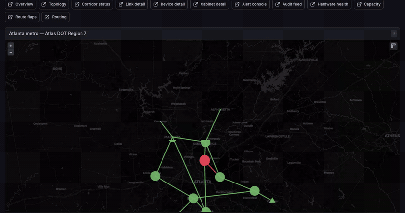
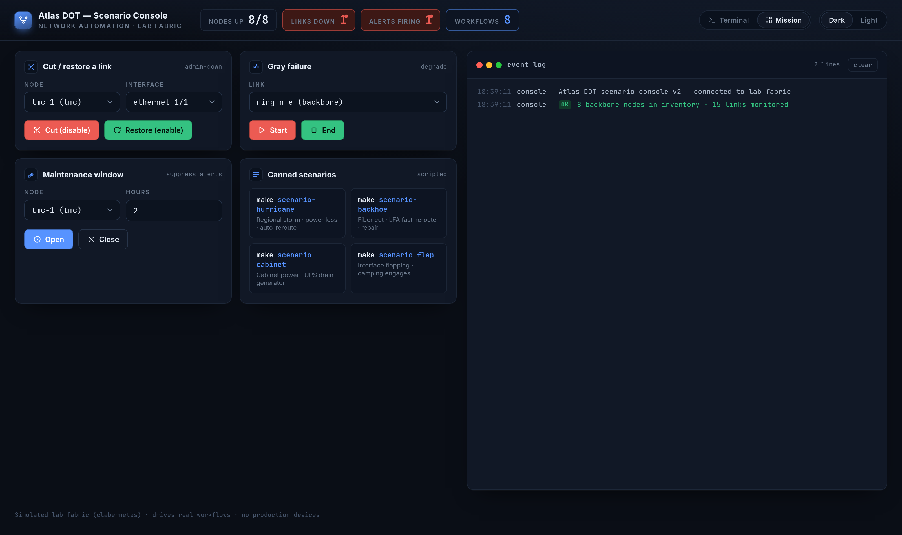
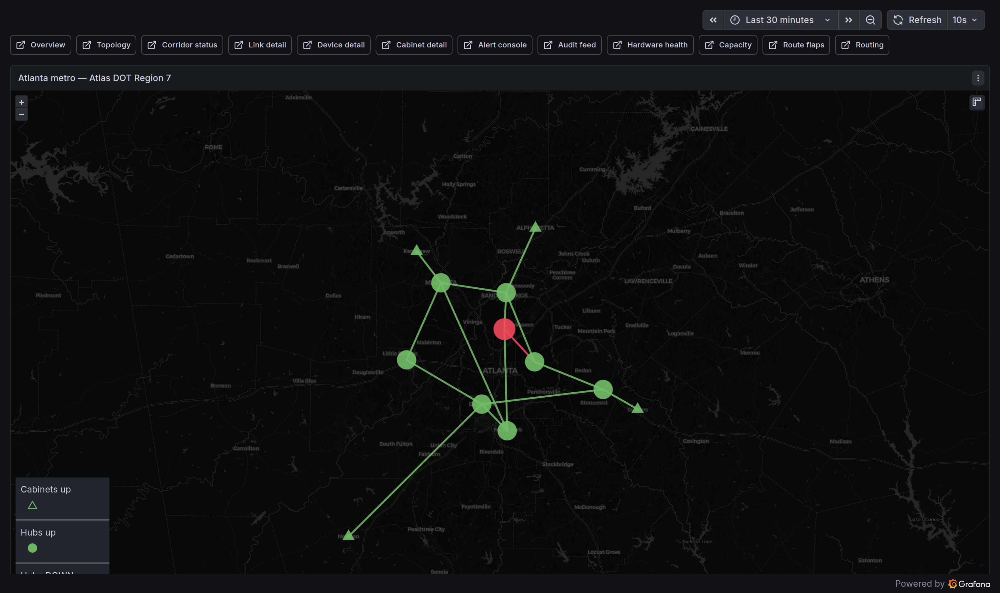
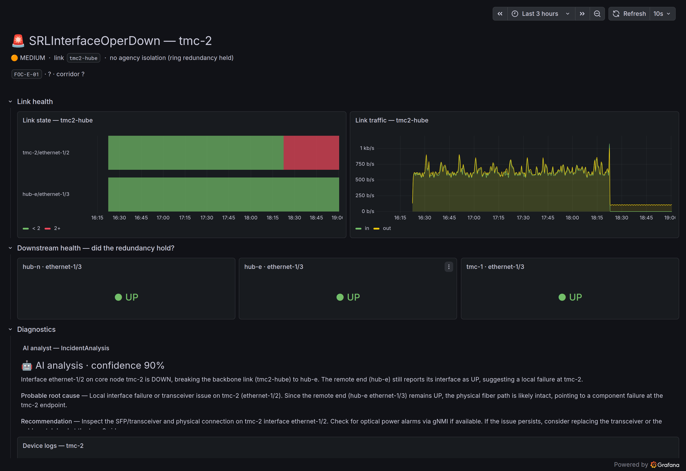
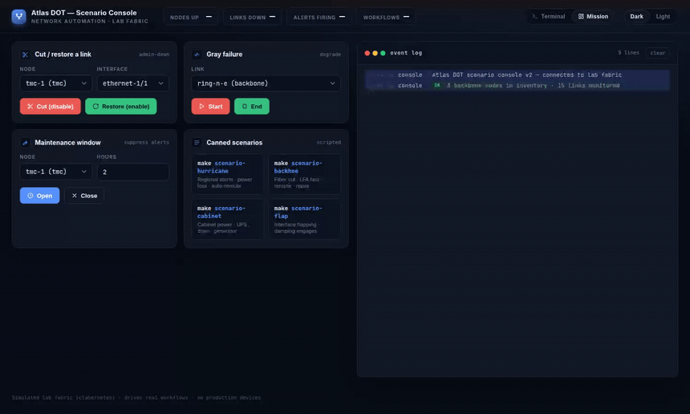
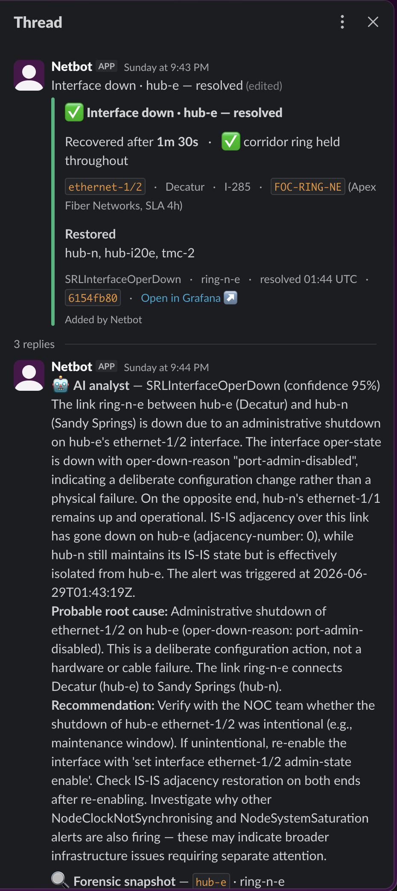

# network-automation-demo

[](https://github.com/jp2195/network-automation-demo/actions/workflows/ci.yml)
[](LICENSE)
[](go.mod)

**A laptop-sized metro fiber network that detects, explains, and helps fix its
own outages — end to end, from streaming telemetry to an enriched Slack
incident.**



> A link cut from the scenario console propagating through the stack: gNMI
> telemetry → Prometheus alert → the node going red on the map. Behind it, an
> Argo Workflow is enriching the alert from NetBox and posting the incident.

It's a self-contained, GitOps-managed Kubernetes demo of
streaming-telemetry-driven incident response over a metro fiber-ring topology
(SR-MPLS by design, IS-IS/IPv4 in the lab; see
[docs/architecture.md](docs/architecture.md) for the scope cut). Every
artifact — SR Linux configs, FRR configs, gNMIc targets, NetBox seed, the
Geomap dashboard, the Clabernetes Topology CR, Prometheus recording rules — is
generated from one source-of-truth file: [`spec/atlanta.yaml`](spec/atlanta.yaml).

The headline isn't "we wired up Slack." It's that a generic interface-down
alert gets enriched with NetBox context (cable, corridor, providers,
agencies), analyzed for downstream impact, and turned into an actionable
Slack message that **updates in place when the alert resolves**. A 5-step
Argo Workflow (enrich → analyze → notify → dashboard → postmortem) drives it,
with an alert-fingerprint-keyed ledger in Valkey.

## Requirements

> [!IMPORTANT]
> - **Host:** 32 GB RAM minimum. macOS on Apple Silicon (verified), Linux, or
>   Windows via WSL 2.
> - **Docker / OrbStack:** give it **≥ 24 GB memory** and **≥ 6 CPUs**. The
>   stack's working set is about 25 GB.
> - **Disk:** about 30 GB free.
> - **Time:** the first run takes 15–25 minutes (image downloads); a warm
>   rebuild takes about 8.
>
> `make doctor` checks all of this before you start.

## Contents

- [Requirements](#requirements)
- [What you'll see in 5 minutes](#what-youll-see-in-5-minutes)
- [Demo lab, not production](#demo-lab-not-production)
- [Topology](#topology)
- [Stack](#stack)
- [Telemetry sources: the legacy / modern split](#telemetry-sources-the-legacy--modern-split)
- [Prerequisites](#prerequisites)
- [Quickstart](#quickstart)
- [Demo flow](#demo-flow)
- [Slack](#slack)
- [More docs](#more-docs)
- [License](#license)

## What you'll see in 5 minutes

With the tools from [Prerequisites](#prerequisites) installed (the first
`make demo` spends 15–25 minutes pulling images; after that it's quick):

1. **`make doctor`** checks your tools, Docker memory, free ports, disk, and
   DNS.
2. **`make demo`** brings everything up, waits until the lab is functionally
   ready, and prints every URL. Add `OPEN=1` to open the console for you.
3. In the **scenario console** (<http://console.127-0-0-1.nip.io:8080>), pick
   `hub-i20e` / `ethernet-1/4` and click **Cut**.
4. Watch the **Grafana Geomap** go red within about 20 seconds, then read
   the incident: in Slack if you've [configured it](SECRETS.md), otherwise
   with **`make last-notify`**, which prints the exact Block Kit payload.
5. Click **Restore**. The alert resolves, the Slack message updates in place,
   and a postmortem is written (`make postmortem`).



> The **scenario console**: a privilege-free Go service that drives real
> fault-injection workflows (cut a link, degrade a link, open a maintenance
> window, or run a scripted scenario) and reflects live fabric state. Every
> button fires a real Argo Workflow; nothing is simulated.

## Demo lab, not production

This repository is a **demo lab**. Don't run it anywhere untrusted people can
reach:

- Every credential is a documented default (`admin` / `admin` for Grafana and
  NetBox, SR Linux demo passwords). See [SECRETS.md](SECRETS.md).
- The scenario console and the Argo Workflows UI have **no authentication**.
- The UIs are served through Traefik on host ports 8080/8443 under
  `*.127-0-0-1.nip.io` hostnames that resolve to your own machine. k3d
  publishes those ports on all host interfaces, so use a trusted network or a
  host firewall. The image registry is bound to 127.0.0.1:5001.

To report a security issue, see [SECURITY.md](SECURITY.md).

## Topology

12 nodes, fictional Atlas DOT Region 7 Atlanta Metro:

- 2 Transportation Management Centers (TMC): SR Linux backbone heads
- 6 corridor hub aggregators: SR Linux on the I-285 / I-75 / I-20 / GA-400 corridors
- 4 field-cabinet routers: FRR (Linux), eBGP into the backbone

15 links total: a 6-link I-285 perimeter ring, 4 TMC uplinks plus a TMC
interconnect, and 4 single-homed cabinet drops.



> The fabric on a real map (Grafana Geomap): backbone ring, hub aggregators,
> and field cabinets across the Atlanta metro. Nodes turn red the moment an
> interface goes oper-down.

## Stack

| Layer | Component |
|---|---|
| Cluster | k3d (k3s in Docker), Traefik ingress, local-path storage |
| GitOps | Argo CD ApplicationSet over `argocd/manifests/` |
| Topology | Clabernetes operator + containerlab-flavored `Topology` CR |
| Source of truth | NetBox (CNPG Postgres + valkey-io Valkey, no Bitnami workloads) |
| Telemetry — modern | gNMIc streaming subscriptions on the SR Linux backbone → Prometheus |
| Telemetry — legacy | Prometheus `snmp_exporter` polling FRR cabinets (IF-MIB) |
| Logs | Alloy DaemonSet → Loki SingleBinary |
| Eventing | Argo Events (NATS JetStream EventBus) → Argo Workflows |
| Notifications | Slack (`slack-sdk` bot, `chat.update` on resolve) |
| AI (optional) | Pydantic AI over any OpenAI-compatible endpoint: per-alert incident analyst + interactive console chat, both read-only ([docs/ai-analyst.md](docs/ai-analyst.md), [docs/chat.md](docs/chat.md)) |
| Certs | cert-manager (self-signed ClusterIssuer, Traefik ingresses on `*.127-0-0-1.nip.io`) |

Apple Silicon / ARM64 is tested: the whole stack runs **natively** on arm64
(no x86 emulation). Clabernetes 0.6.0 ships multi-arch manager/launcher
images, and the node images are multi-arch too (SR Linux
`ghcr.io/nokia/srlinux` 25.3.3, FRR 10.6.2). Verified end-to-end on an Apple
Silicon Mac via k3d: full platform up, `atlanta` topology ready, all 12 nodes
`aarch64`.

## Telemetry sources: the legacy / modern split

The 8 SR Linux backbone nodes stream telemetry via gNMI to gNMIc, which
exposes it as Prometheus metrics (`srl_*`) across three tiered subscription
groups: `if-state` every 5 s, `if-counters` every 10 s, `system` every 60 s.
Optical DOM metrics come from the separate `dom-synth` synthetic exporter,
since there are no real SFPs in a container lab. This is the modern lane:
push-based and schema-defined, with measured end-to-end *detection* of about
18 s (bounded by the 30 s Prometheus rule-evaluation interval, not the 5 s
sample). That is still several times faster than the legacy lane; see
[results/RESULTS-SUMMARY.md](results/RESULTS-SUMMARY.md).

The 4 FRR field cabinets are deliberately *not* on that pipeline. Each
cabinet runs a tiny `snmpd` (installed on first boot via `apk add net-snmp`
in the entrypoint wrapper) listening for SNMPv2c on UDP/161. A
`prom/snmp-exporter` deployment polls each cabinet every 300 s (5 min, a
representative enterprise polling cadence, not a 30 s strawman) for the
standard `IF-MIB` tables, and a Prometheus Operator `Probe` CR registers them
with kube-prometheus-stack.

The point: the rest of the demo (Alertmanager → EventSource → Sensor →
enriched-notify Workflow → Slack) is **identical** for both telemetry sources.
The legacy edge and the modern core land in the same incident response flow,
with the same NetBox enrichment and impact analysis. Mixed legacy/modern fleets
don't have to rip and replace to get modern incident response; that
decoupling is the operational takeaway.

| Lane | Nodes | Collection | Sample rate | Metric prefix |
|---|---|---|---|---|
| Modern | 8 SR Linux backbone | gNMI streaming → gNMIc | 5 s state / 10 s counters / 60 s system (+ synthetic DOM via `dom-synth`, 15 s scrape) | `srl_*` |
| Legacy | 4 FRR field cabinets | SNMPv2c polling → snmp_exporter | 300 s (5 min) | `ifOperStatus`, `ifInOctets`, … |

## Prerequisites

> **New to Docker / Kubernetes / the command line?** Start with
> **[GETTING-STARTED.md](GETTING-STARTED.md)**, a step-by-step, per-OS
> (macOS / Windows / Linux) install-and-run walkthrough written for newcomers.
> The rest of this README assumes you're already comfortable with these tools.

- Docker with `buildx` (Docker Desktop, or [OrbStack](https://orbstack.dev)
  on macOS), sized per [Requirements](#requirements).
  **Windows:** run everything inside [WSL 2](https://learn.microsoft.com/windows/wsl/)
  with the Docker Desktop WSL backend; see [GETTING-STARTED.md](GETTING-STARTED.md).
- [`k3d`](https://k3d.io) ≥ v5.6
- `kubectl`
- `helm`
- `make`
- `python3` and `jq` (used by `make ready`, the measurement scripts, and
  `make maintenance-list`)
- `go` 1.26+ (only if you re-render from spec)
- **`fs.inotify.max_user_instances` ≥ 512** (Linux and WSL hosts). The
  default of 128 is too low for this stack: the argo-events data plane
  crashloops with "too many open files" and the cut→notify automation
  silently never fires. `make doctor` warns if it's too low. Raise it once:

  ```bash
  sudo sysctl fs.inotify.max_user_instances=1024
  echo 'fs.inotify.max_user_instances=1024' | sudo tee /etc/sysctl.d/99-inotify.conf
  ```

## Quickstart

```bash
git clone https://github.com/jp2195/network-automation-demo.git
cd network-automation-demo
make doctor    # preflight: tools, Docker memory, ports 8080/8443/5001, disk, DNS, inotify
make demo      # up + wait until functionally ready + print URLs (OPEN=1 opens the console)
```

The pieces, if you want them separately:

```bash
make up          # create k3d, build images, install Argo CD, apply the root Application
                 # (runs `make doctor` first; safe to re-run after a failure)
make wait-ready  # poll the readiness gate (bin/ready.sh) for up to ~25 min
make status      # nodes + Argo CD app state + URLs
make urls        # every UI URL and credential, including the Argo CD admin password
make down        # tear the cluster down
```

> **The cluster deploys from Git, not from your checkout.** Every Argo CD
> `Application` pulls `https://github.com/jp2195/network-automation-demo.git`
> on `main`, so cloning upstream works as-is. Local edits only reach the
> cluster once they're pushed. To run your own fork or branch, point the
> cluster at it first:
>
> ```bash
> make repoint REPO=https://github.com/<you>/network-automation-demo.git REV=<branch>
> ```
>
> That rewrites `repoURL` / `targetRevision` in `bootstrap/root-app.yaml`
> and `argocd/applicationset.yaml`; commit and push the change, then
> `make up`.

UIs after sync settles (Traefik serves every ingress on both `:8080` plain
HTTP and `:8443` HTTPS; the `http://…:8080` URLs below avoid the self-signed
TLS warning):

| URL | Notes |
|---|---|
| <http://console.127-0-0-1.nip.io:8080> | scenario console, no auth |
| <http://grafana.127-0-0-1.nip.io:8080> | admin / admin |
| <http://argocd.127-0-0-1.nip.io:8080> | admin / `make urls` shows the password |
| <http://netbox.127-0-0-1.nip.io:8080> | admin / admin |
| <http://workflows.127-0-0-1.nip.io:8080> | server mode, no auth |
| <http://clabernetes.127-0-0-1.nip.io:8080> | Clabernetes UI |

If those hostnames don't resolve (some corporate and conference networks
block DNS answers that point at 127.0.0.1), see the
[troubleshooting runbook](docs/runbook-troubleshoot.md#browser-cant-resolve-127-0-0-1nipio)
for a one-line `/etc/hosts` fix.

### Pre-baked images

`make up` (and `make build` standalone) builds and pushes five pre-baked
images into the k3d-bundled registry:

- `localhost:5001/eventing-py:latest`: Python + slack-sdk + valkey + eventing scripts.
- `localhost:5001/dom-synth:latest`: Python + valkey + dom_synth.py.
- `localhost:5001/ai-analyst:latest`: Python + Pydantic AI + the read-only
  tool deps (pygnmi Get-only, SNMP, PromQL/LogQL/NetBox over stdlib) for the
  advisory AI lane. A no-op unless you create the optional `ai-analyst`
  Secret (see [SECRETS.md](SECRETS.md)).
- `localhost:5001/chat-agent:latest`: Python + Pydantic AI + FastAPI for
  the console's **Ask the network** chat: interactive read-only Q&A over
  NetBox/Prometheus/Loki with deterministic blast-radius and alert tools
  ([docs/chat.md](docs/chat.md)). Shares the optional `ai-analyst` Secret;
  disabled without it.
- `localhost:5001/console:latest`: the scenario console (Go static binary
  on distroless). Drives cut/restore, gray failure, and maintenance from the
  browser, shows a live status strip, and hosts the chat panel.

The FRR cabinets use the stock `quay.io/frrouting/frr` image and install
`net-snmp` at boot, so there is no custom FRR image.

Note the two endpoints for the SAME registry:

- **`localhost:5001`**: used by `docker buildx … --push` from the host
  (bound to 127.0.0.1).
- **`atlas-demo-registry:5001`**: used by every workload manifest's
  `image:` field, because that's how the registry resolves from inside
  the cluster.

These five images deliberately stay on `:latest`: `make build` rebuilds and
pushes them on every `make up`, and the registry lives and dies with the k3d
cluster, so a pinned tag would only add a version-bump step to the edit loop
without making anything more reproducible. Their Python dependencies are
pinned in the Dockerfiles. Upstream images (SR Linux, FRR, gNMIc, …) ARE
pinned; see `workloads/versions.yaml`. Renovate keeps the pins current.

This is configured by `k3d/config.yaml` (registry name + host port mapping).
Verify images are pushed with:

```bash
curl -s localhost:5001/v2/_catalog
```

## Demo flow

For a scripted, timed walkthrough for an audience, use
[docs/runbook-demo.md](docs/runbook-demo.md). For a plain-language tour of
every feature, see [FEATURES.md](FEATURES.md).

Once IS-IS has converged across the 8 SR Linux backbone nodes and
snmp_exporter is reaching all 4 cabinets (`make ready` is green):

**Modern lane (gNMI / SR Linux):**

```bash
# Admin-disable an interface with a gNMI Set (as the noc-ops operator).
# gNMIc sees oper-status DOWN, the Prometheus rule fires, Alertmanager
# webhooks the EventSource, the Sensor triggers the enriched-notify
# Workflow, and Slack gets a Block Kit message.
make demo-cut     NODE=hub-i20e INTERFACE=ethernet-1/4

# Re-enable it. The same alert fingerprint resolves; the original Slack
# message is updated in place to RESOLVED with downtime, and a thread
# reply summarizes which downstream cabinets/agencies are restored.
make demo-restore NODE=hub-i20e INTERFACE=ethernet-1/4
```

A real **fiber cut** instead of an admin shutdown: down the link at the
physical layer so it goes oper-down with `admin-state` still *up*. It raises
the same `SRLInterfaceOperDown` alert, but the AI analyst reads
`admin-state=enable` plus a physical `oper-down-reason` and calls it a
hardware/link failure, whereas `demo-cut` (admin disable) reads as a
deliberate maintenance action. The pair shows the analyst telling a real
fault from maintenance.

```bash
make demo-cut-fiber     NODE=hub-e INTERFACE=ethernet-1/2
make demo-restore-fiber NODE=hub-e INTERFACE=ethernet-1/2
```

**Legacy lane (SNMP / FRR cabinet):**

```bash
# Same enrich/analyze/notify pipeline, but the alert is sourced from
# snmp_exporter polling the cabinet's snmpd rather than streaming gNMI.
make demo-cut-cabinet     NODE=fc-n INTERFACE=eth1
make demo-restore-cabinet NODE=fc-n INTERFACE=eth1
```

The 5-step DAG:

1. **enrich**: NetBox lookup: device → site → primary IP → interface →
   cable → custom fields (corridor, provider, SLA, route description).
2. **analyze**: walk the cable graph from the affected device to find
   downstream cabinets, the agency tenants on each, the modeled backup path,
   and a `severity_class` (high if a cabinet is impacted, medium if multiple
   downstream devices, else low).
3. **notify**: branches on `alert.status`:
   - `firing`: `chat.postMessage` Block Kit; persist
     `{ts, channel, first_seen, impact}` in Valkey under
     `incident:<fingerprint>` with a 24h TTL.
   - `resolved`: load the ledger, `chat.update` the original message
     in place (✅ + downtime), thread reply with the resolution
     summary, DEL the ledger key.
4. **dashboard**: create the [per-incident Grafana dashboard](#per-incident-dashboard)
   on firing; delete it on resolve.
5. **postmortem**: on resolve, write the Markdown
   [postmortem](#postmortem-generator) to Valkey.

`make last-notify` prints the payload of the newest notify step, so you can
see the incident message without Slack.

### Measuring it

The latency claims are *measured*, not asserted; see
[results/RESULTS-SUMMARY.md](results/RESULTS-SUMMARY.md) for the table.

```bash
make ready                         # functional readiness gate: telemetry flowing,
                                   # eventing wired, cabinets polling (non-zero if not ready)

make measure N=20 LANE=gnmi        # N cut->detect->enriched-notify cycles; exact
make measure N=8  LANE=snmp        # timestamps -> CSV + mean/median/p95 per lane
                                   # (streaming ~18s detection vs 5-min polling ~minutes)

make measure-gray DURATIONS="180 360 600"   # gray-failure detectability: streaming
                                   # catches it, 5-min polling is probabilistic, SNMP
                                   # traps are blind (no trap for a rising error gauge)
```

Each run rotates a distinct interface (independent incident) and differences
exact Prometheus/Argo object timestamps against the cut. The
streaming-vs-polling detection delta and the **lane-independent ~30 s
enrichment** are the defensible results: understanding, not just detection,
is the contribution.

### Closed-loop remediation

Gray failures are the one case IS-IS will not route around on its own: the
link stays up while the optics degrade. When `SRLOpticalDegrading` /
`SRLInterfaceErrorsHigh` fire, the `remediation` Sensor launches a
`remediate-link` Workflow that **costs the link out** (IS-IS metric 16777214
on both ends, applied over gNMI, the same management plane the telemetry
uses). Traffic shifts to the healthy ring path within seconds; when the
warning resolves, a second Workflow deletes the metric override and the link
returns to service. State (claims, mode, approvals) lives in Valkey.

```bash
make scenario-gray-failure LINK=ring-e-i20e   # watch the workflow cost the link out
make remediation-status                        # current mode + active cost-outs

make remediation-mode MODE=gated               # require human approval first
make remediation-approve LINK=ring-e-i20e      # release a pending gated remediation
make remediation-mode MODE=auto                # back to full closed-loop
```

The deterministic remediation and fault-injection lanes are the only
components in the cluster holding gNMI *Set* capability; everything else,
including the AI analyst, is structurally read-only.

### Config drift audit

NetBox + Git say what the network *should* be; the drift audit proves the
network *is* that. Every 5 minutes a CronWorkflow pulls each SR Linux node's
running config over gNMI and diffs it against the rendered intent (interface
admin-state, IS-IS metric overrides). Any divergence raises a `ConfigDrift`
warning through the same enrich→notify pipeline as an outage, so an
out-of-band change (try `make demo-cut NODE=hub-e INTERFACE=ethernet-1/3`) is
caught, named precisely, and self-resolves once the config is brought back in
line. Metric overrides applied by the closed-loop remediation are recognized
as platform actions and suppressed, not flagged.

```bash
make drift-check    # run the audit immediately
```

### Postmortem generator

Every incident closes with a written artifact. When an alert resolves, the
enriched-notify Workflow's final step assembles a Markdown postmortem:
timeline (first seen → resolved, duration), alert and cable context, impact
table (downstream devices, affected agencies), restoration-SLA math, the
link-state telemetry around the window, and device log excerpts from Loki.
It's stored in Valkey for seven days, keyed by the alert fingerprint. When the
optional AI incident analyst is enabled, its narrative for the same
fingerprint is appended as an extra section; absent, the deterministic report
stands alone.

```bash
make postmortem                      # list stored postmortems
make postmortem FP=<fingerprint>     # print one (also saved to /tmp)
```

### AI incident analyst (optional)

A parallel, **advisory-only** lane: a Pydantic AI agent investigates the same
alert through structurally read-only tools (PromQL, LogQL, NetBox GET, gNMI
Get, SNMP GET) and emits a structured `IncidentAnalysis` (summary, probable
root cause, recommendation, confidence, evidence). It is **off** until you
create the optional `ai-analyst` Secret. Point it at any OpenAI-compatible
endpoint (OpenAI, Anthropic, Gemini) or a local Ollama for zero cost; absent,
the lane no-ops and the deterministic pipeline is unaffected. The analysis
lands on the **Alert console** dashboard, is folded into the postmortem, and
is rendered onto the per-incident dashboard. It is advisory forever: it never
executes remediation. Full design + safety boundaries:
[docs/ai-analyst.md](docs/ai-analyst.md); setup recipes + tuning knobs:
[SECRETS.md](SECRETS.md).

### Per-incident dashboard

On every firing alert, the enriched-notify pipeline auto-generates a Grafana
dashboard for that one incident (link state timeline, traffic, a
downstream-health grid, the AI analysis, device logs) as a ConfigMap in the
`incident-dashboards` namespace. The Grafana sidecar discovers it and places
it in the **Incidents** folder; the pipeline deletes it on resolve. No Grafana
API token needed; the lane holds only namespaced ConfigMap create/delete.



> An auto-generated per-incident dashboard. Link-state timeline, traffic, and a
> downstream "did redundancy hold?" grid, with the **AI analyst's** structured
> finding (root cause, recommendation, confidence) rendered in-panel. The
> analysis above was produced by a local model via Ollama at zero cost.

### Scenario console

A point-and-click way to drive the whole demo. Pick a link and cut it, degrade
a link into a gray failure, open a maintenance window, or run a scripted
scenario. Every button fires a real Argo Workflow, and the status tiles and
event log reflect live fabric state (no fabricated telemetry). The console
only accepts nodes, interfaces, and links from its rendered allowlist and
rejects cross-origin POSTs.



## Slack



The incident posts as a severity-colored card (red for high, orange for
medium, yellow for warning, blue for low; green on resolve) that reads
top-down the way an operator triages: a one-line verdict fusing severity with
the **modeled backup state** ("traffic protected by corridor ring" vs "no
protected path — single-homed cabinet"), then device · site · corridor,
downstream impact, and affected agencies, with the raw alertname / link_id /
fingerprint and a per-incident Grafana link demoted to a muted footer. The
human title ("Interface down") leads; the raw `SRLInterfaceOperDown` lives in
the footer. On resolve the **same message is updated in place** (green,
downtime) rather than reposted. Depth lands as **thread replies**: a forensic
snapshot (the optical DOM table, aligned) and the AI analyst's root cause +
recommendation, so the channel stays scannable and the detail is one click in.
Alertmanager's hourly repeat notifications for a still-firing alert are
deduplicated, so a long outage doesn't spam the channel.

Without real Slack credentials the workflow's notify step prints the Block Kit
payload to stderr instead of calling the API. `make last-notify` shows it.

**To enable real posting without committing your bot token to Git**, see
[SECRETS.md](SECRETS.md) for the override patterns (a hand-applied
`secrets.local/slack-bot.yaml`, or sealed-secrets for Git-stored encrypted
secrets).

<br clear="right">

## More docs

- **[GETTING-STARTED.md](GETTING-STARTED.md)**: newcomer-friendly, per-OS
  (macOS / Windows / Linux) install-and-run walkthrough. Start here if you're
  new to Docker/Kubernetes.
- **[FEATURES.md](FEATURES.md)**: plain-language tour of every feature (the
  self-enriching alert, closed-loop remediation, config-drift audit,
  postmortems, the AI analyst, the per-incident dashboard, scenarios,
  maintenance windows, the console, chat) with the exact command to try each.
- [docs/runbook-demo.md](docs/runbook-demo.md): pre-demo checklist, the live
  demo script (≈10 min), optional Slack hook-up.
- [docs/runbook-troubleshoot.md](docs/runbook-troubleshoot.md): symptom →
  diagnosis lookup table, subtle gotchas, hard reset.
- [docs/architecture.md](docs/architecture.md): layered architecture, why each
  piece is here, the gNMI / SNMP / DOM split, eventing flow, sync waves,
  re-rendering from spec, and the repository layout.
- [docs/ai-analyst.md](docs/ai-analyst.md): the advisory AI incident analyst,
  its tools and safety boundaries.
- [docs/chat.md](docs/chat.md): the console's "Ask the network" chat.
- [results/RESULTS-SUMMARY.md](results/RESULTS-SUMMARY.md): measured
  detection and enrichment latency, streaming vs polling.
- [SECRETS.md](SECRETS.md): optional Slack and AI-analyst credentials, and how
  the demo degrades gracefully without them.
- [CONTRIBUTING.md](CONTRIBUTING.md): changing the lab: the renderer, the
  drift gate, tests, and CI.
- [SECURITY.md](SECURITY.md): scope and how to report a vulnerability.

## License

[MIT](LICENSE).
